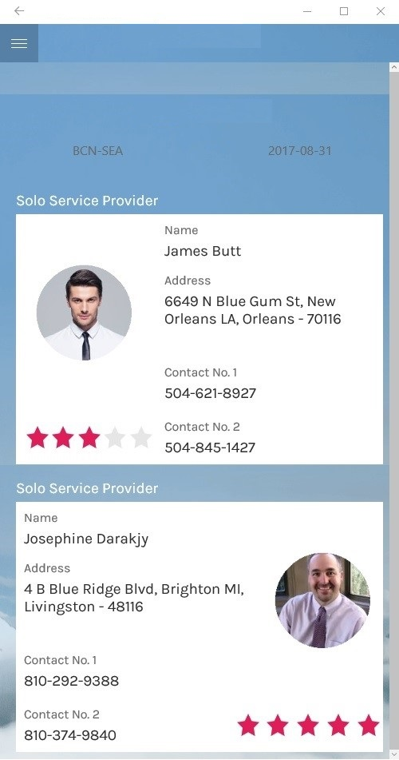
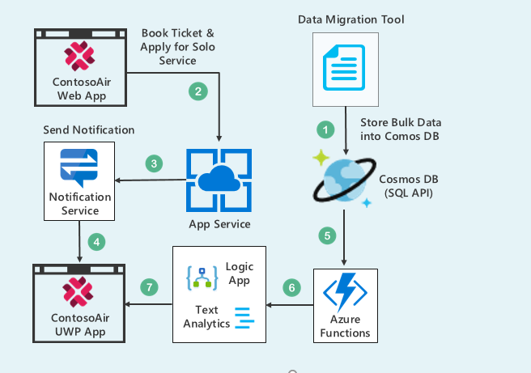

# Integrating Cosmos DB (SQL API) and Azure Notification Service with Universal Windows Platform Application
## User Story

Consider the user scenario, Alice, the daughter of Kevin, is a minor and willing to travel from **Seattle** to **Barcelona** and wants to avail &quot; **Flying Solo Service**&quot; provided by Airline. But as a parent, Kevin needs to know and be assured that the child will be taken care of.

Using **ContosoAir app** you will come across **Azure Notification APIs** , **Text Analytics API** , **Azure Function** , **Logic App** and **Cosmos DB**. After completion of the flight booking process through **ContosoAir application** you will get the reviews of staff serving the flying solo service through push notifications.

 

## Components Used in Scenario

 

- **Notification Hubs** / **Azure Notification APIs** , a multi-platform, scalable push-notification engine for quickly sending millions of messages. ( [Notification API](https://docs.microsoft.com/en-us/azure/notification-hubs/notification-hubs-push-notification-overview))
- **Text Analytics API** is a cloud-based service that provides advanced natural language processing over raw text, and includes three main functions: sentiment analysis, key phrase extraction, and language detection. ( [Text Analytics API](https://docs.microsoft.com/en-in/azure/cognitive-services/text-analytics/overview))
- **Azure Functions** is a serverless compute service that enables you to run code on-demand without having to explicitly provision or manage infrastructure. Use Azure Functions to run a script or piece of code in response to a variety of events. ( [Azure Functions](https://docs.microsoft.com/en-us/azure/azure-functions/))
- **Logic Apps** provide a way to simplify and implement scalable integrations and workflows in the cloud. It provides a visual designer to model and automate your process as a series of steps known as a workflow. ( [Logic Apps](https://docs.microsoft.com/en-us/azure/logic-apps/))
- **Azure Cosmos DB** is Microsoft&#39;s globally distributed, multi-model database. With the click of a button, Azure Cosmos DB enables you to elastically and independently scale throughput and storage across any number of Azure&#39;s geographic regions. It offers throughput, latency, availability, and consistency guarantees with comprehensive  [service level agreements](https://aka.ms/acdbsla) (SLAs), something no other database service can offer. ( [Azure Cosmos DB](https://docs.microsoft.com/en-us/azure/cosmos-db/))

## What you will learn from this experience

- Create collections/insert data in **Cosmos DB** using **Data Migration Tool**.
- Creating **Azure Functions** to retrieve data of ground staff serving the Flying Solo service.
- Playing around code in **Visual Studio 2017** IDE to change the availability of staff serving the Flying Solo Service.
- Creating **Logic App** and integrating **Text Analytics.**
- Playing around code in **Visual Studio 2017** IDE to change reviews of staff serving Flying Solo Service.
- Configuration of **Notification API.**
- Playing with **ContosoAir Application** to book tickets and get timely notifications.

**Ready? Let&#39;s get started!**

> ### Ready? Let&#39;s get started!
